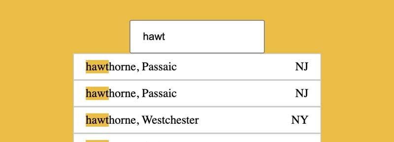

# js-ajax-type-ahead
An search input that filters for city, county.

## How Its Done
Uses fetch api to retrieve data from a json endpoint. When the input detects change or keyup event a function is called to displayMatches. First we find the match using the string typed and the json data array and filter it to return city and county. In that filter we use regex since the search string is always dynamic. Then map through that result to return a list item of the results for each place. Finally we use innerHTML to replace the existing list items with the resulting list item from the filtered search.

